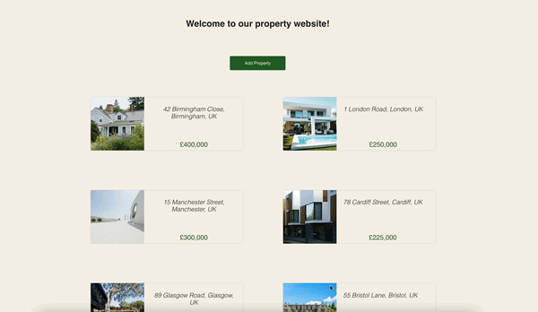

# properties-client

_properties-client_ is an application built with React (bootstrapped with CRA) and powered by REST API and MongoDB database. The API documentation is available [here](https://github.com/elenaharan/properties_api).

## Features

- _Property List_ displays a list of all properties for sale. The list of properties is fetched from the Node server, which is deployed on Heroku.
- _Add a property_ feature allows users to add a new property to the existing list. This is done via a POST request to the Node server. The list of properties then gets updated, and the new property gets displayed in the list.

## Technologies

This application is built with the MERN tech stack (MongoDB, Express, React, and Node.js)

### Terminal commands

#### `npm start`

Runs the app in the development mode.\
Open [http://localhost:3000](http://localhost:3000) to view it in the browser.

#### `npm test`

Launches the test runner in the interactive watch mode.\

#### `npm run build`

Builds the app for production to the `build` folder.\
It correctly bundles React in production mode and optimizes the build for the best performance.
